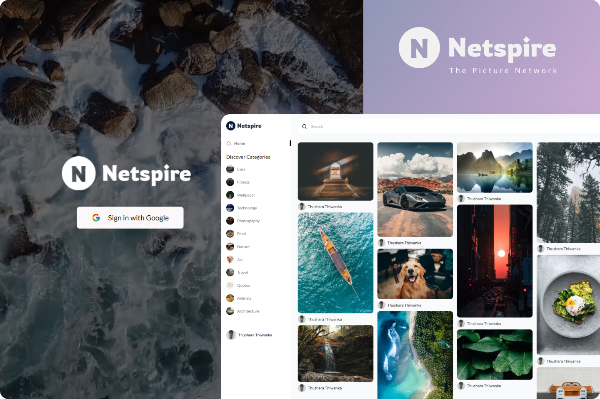

# Netspire

Netspire - The picture network is image sharing platform. which provides a platform for users to share their pictures with other users. users can comment on each picture and download and save each picture.

## Technologies

   

## Getting Started

### Prerequisites

- Node JS should be installed

### Running the project

- In the project directory, you can run below commands to install the dependencies and run the app:

  1. ### `npm install` - install frontend dependencies
  2. ### `cd api && npm install` - install backend dependencies
  3. ### setup the environment variables inside .env.examples file and rename file to .env
  4. ### `npm start` - start the frontend
  5. ### `cd api && sanity start` - start the sanity server

### Available Scripts

In the root directory, you can run:

### `npm start`

Runs the app in the development mode.\
Open [http://localhost:3000](http://localhost:3000) to view it in your browser.

### `npm run build`

Builds the app for production to the `build` folder.\
It correctly bundles React in production mode and optimizes the build for the best performance.

The build is minified and the filenames include the hashes.\
Your app is ready to be deployed!

### `npm test`

Launches the test runner in the interactive watch mode.\
See the section about [running tests](https://facebook.github.io/create-react-app/docs/running-tests) for more information.

### `npm run eject`

**Note: this is a one-way operation. Once you `eject`, you can't go back!**

If you aren't satisfied with the build tool and configuration choices, you can `eject` at any time. This command will remove the single build dependency from your project.

Instead, it will copy all the configuration files and the transitive dependencies (webpack, Babel, ESLint, etc) right into your project so you have full control over them. All of the commands except `eject` will still work, but they will point to the copied scripts so you can tweak them. At this point you're on your own.

In the api directory, you can run:

### `sanity start`

Runs the backend sanity server.\
Open [http://localhost:3333](http://localhost:3333) to view it in your browser.
